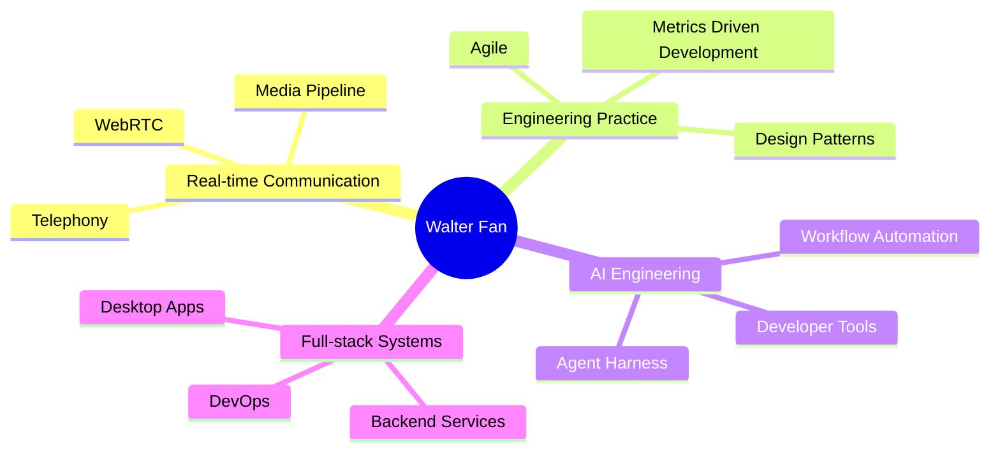

<h1 align="center">Hi, I'm Walter Fan</h1>

  <strong>Full-stack engineer · Real-time communication practitioner · AI engineering explorer</strong>

  
  
  

I build software across backend services, web applications, desktop tools, media systems, and AI-assisted engineering workflows. I also write about engineering practice, Metrics Driven Development, WebRTC, design patterns, security and the craft of building reliable systems.

## Engineering Focus

## Featured Writing

| Topic | Repository | Online Version |
| --- | --- | --- |
| Metrics Driven Development | [mdd](https://github.com/walterfan/mdd) | [Read online](https://walterfan.github.io/mdd) |
| WebRTC Primer | [webrtc_primer](https://github.com/walterfan/webrtc_primer) | [Read online](https://walterfan.github.io/webrtc_note) |
| Software Engineering in AI Era | [walter-ai-engineering-book](https://github.com/walterfan/walter-ai-engineering-book) | [Read online](https://walterfan.github.io/walter-ai-engineering-book) |
| Harnessing AI: The Craft of Shaping Agents | [walter-ai-harness-book](https://github.com/walterfan/walter-ai-harness-book) | [Read online](https://walterfan.github.io/walter-ai-harness-book/) |
| Desktop Apps with Tauri + Rust | [walter-rust-tauri-book](https://github.com/walterfan/walter-rust-tauri-book) | [Read online](https://walterfan.github.io/walter-rust-tauri-book) |
| The Tao of Agile | [the-tao-of-agile](https://github.com/walterfan/the-tao-of-agile) | - |
| The Security Handbook | [security-handbook](https://github.com/walterfan/security-handbook) | - |
| DevOps Cookbook | [devops-cookbook](https://github.com/walterfan/devops-cookbook) | - |
| GStreamer Cookbook | [gstreamer-cookbook](https://github.com/walterfan/gstreamer-cookbook) | - |

## Selected Projects

### Productive Tools

- [Lazy Todo App](https://github.com/walterfan/lazy-todo-app): desktop app for todo lists, sticky notes, Pomodoro, toolbox, and virtual agents.
- [Lazy Form Instructor](https://github.com/walterfan/lazy-form-instructor): Java library for AI-assisted smart form filling and execution.
- [Web Diagram](https://github.com/walterfan/webdiagram): web app for generating UML, mind maps, and flow charts with Flask, Graphviz, and PlantUML.
- [GStreamer Pipeline Verifier](https://github.com/walterfan/gst-pipeline-verifier): C++ tool for validating GStreamer pipelines.
- [WebRTC Stats Tool](https://github.com/walterfan/webrtc_stats): parser and analyzer for Chrome WebRTC internals dumps.
- [Video Codec Analyzer](https://github.com/walterfan/video_codec_analyzer): H.264 codec analysis tool in C++.
- [gtest2html](https://github.com/walterfan/gtest2html): Python utility that converts GoogleTest XML reports to Markdown or HTML.

### AI and Media Experiments

- [AI Dress Recommender](https://github.com/walterfan/ai-dress-recommender): weather-aware dress recommendation powered by AI and LLMs.
- [WebRTC Transcriber](https://github.com/walterfan/webrtc-transcriber): WebRTC recorder that converts speech to text.
- [OCR Web App](https://github.com/walterfan/webocr): image text recognition app based on libtesseract.
- [video_to_text](https://github.com/walterfan/video_to_text): tool for extracting text from video or image files and generating subtitle translations.

### Examples and Code Katas

- [WebRTC Snippets](https://github.com/walterfan/webrtc_snippets): WebRTC-related snippets and experiments.
- [WebRTC Video Chat](https://github.com/walterfan/webrtc_video_chat): WebRTC video chat example.
- [WebRTC Remote Sharing](https://github.com/walterfan/webrtc_remote_sharing): remote sharing example based on WebRTC.
- [Code Kata](https://github.com/walterfan/code-kata): coding exercises across C++, Java, Python, Go, JavaScript, TypeScript, HTML, and CSS.

Explore more at [github.com/walterfan?tab=repositories](https://github.com/walterfan?tab=repositories).

## Technology Stack

## GitHub Snapshot

  
  

