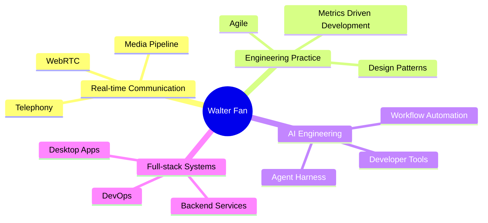

<h1 align="center">Hi, I'm Walter Fan</h1>

  <strong>Full-stack engineer · Real-time communication practitioner · AI engineering explorer</strong>

  
  
  

I build software across backend services, web applications, desktop tools, media systems, and AI-assisted engineering workflows. I also write about engineering practice, Metrics Driven Development, WebRTC, design patterns, security and the craft of building reliable systems.

## Engineering Focus

```mermaid
mindmap
  root((Walter Fan))
    Real-time Communication
      WebRTC
      Media Pipeline
      Telephony
    Engineering Practice
      Metrics Driven Development
      Agile
      Design Patterns
    AI Engineering
      Agent Harness
      Developer Tools
      Workflow Automation
    Full-stack Systems
      Backend Services
      Desktop Apps
      DevOps
```

## Featured Writing

| Topic | Repository | Online Version |
| --- | --- | --- |
| Metrics Driven Development | [mdd](https://github.com/walterfan/mdd) | [Read online](https://walterfan.github.io/mdd) |
| WebRTC Primer | [webrtc_primer](https://github.com/walterfan/webrtc_primer) | [Read online](https://walterfan.github.io/webrtc_note) |
| Software Engineering in AI Era | [ai-engineering-primer](https://github.com/walterfan/ai-engineering-primer) | [Read online](https://walterfan.github.io/ai-engineering-primer) |
| Harnessing AI: The Craft of Shaping Agents | [ai-harness-primer](https://github.com/walterfan/ai-harness-primer) | [Read online](https://walterfan.github.io/ai-harness-primer/) |
| AI Agent Loop Tutorial | [agent-loop-tutorial](https://github.com/walterfan/agent-loop-tutorial) | - |
| Desktop Apps with Tauri + Rust | [rust-tauri-primer](https://github.com/walterfan/rust-tauri-primer) | [Read online](https://walterfan.github.io/rust-tauri-primer) |
| The Tao of Agile | [the-tao-of-agile](https://github.com/walterfan/the-tao-of-agile) | - |
| The Security Master | [security-master](https://github.com/walterfan/security-master) | - |
| DevOps Cookbook | [devops-cookbook](https://github.com/walterfan/devops-cookbook) | - |
| GStreamer Cookbook | [gstreamer-cookbook](https://github.com/walterfan/gstreamer-cookbook) | - |

## Side Projects

### Recent Work

| Project | Focus | Notes |
| --- | --- | --- |
| [gitman](https://github.com/walterfan/gitman) | Local git expert | Python CLI that turns natural language into a reviewed git command plan, drafts a commit message from the real diff, and executes only after confirmation, with an optional loopback Web UI. |
| [smart-form-instructor](https://github.com/walterfan/smart-form-instructor) | LLM-driven smart form engine | Java library, inspired by Python Instructor, that turns one sentence into a schema-validated form with confidence scores, retries, and an AI DAG workflow for review and routing via Spring AI. |
| [lazy-code-kg](https://github.com/walterfan/lazy-code-kg) | Code knowledge graph | Go CLI (`codekg`) that indexes a repo into a local SQLite knowledge graph with tree-sitter, embeddings, hybrid search, and an MCP server for AI-agent workflows. |
| [gouml](https://github.com/walterfan/gouml) | UML from Go source | Go CLI that uses `go/types` to generate PlantUML or Mermaid class diagrams, including implicit interface implementations, embeddings, and optional PNG/SVG rendering. |
| [agent-loop-tutorial](https://github.com/walterfan/agent-loop-tutorial) | AI Agent Loop tutorial | Hands-on Quarto + Jupyter book that builds an Agent from a 20-line think-act-observe loop to production, with runnable notebooks for tools, safety, memory, planning, and real LLM tasks. |
| [markpad](https://github.com/walterfan/markpad) | Local Markdown editor, reader, translator, and diagram renderer | Python/Poetry web tool with a file tree, split Markdown source and HTML preview, eye-friendly themes, Mermaid and PlantUML rendering, and OpenAI-compatible LLM translation. |
| [cpp-100-mistakes](https://github.com/walterfan/cpp-100-mistakes) | C++ pitfalls and lessons learned | A practical book-style collection of common C++ mistakes with an online edition at [walterfan.github.io/cpp-100-mistakes](https://walterfan.github.io/cpp-100-mistakes). |
| [face-detection-webrtc](https://github.com/walterfan/face-detection-webrtc) | Face detection, landmarks, training, and recognition demo | Computer vision playground using OpenCV Haar detection, MediaPipe Face Mesh, LBPH recognition, FastAPI, Vue/Vite, and browser camera capture via WebRTC `getUserMedia`. |

### Lazy Rabbit Studio

| Project | Focus | Notes |
| --- | --- | --- |
| [lazy-code-kg](https://github.com/walterfan/lazy-code-kg) | Code knowledge graph for AI agents | Indexes source into entities and relations, stores them in SQLite with sqlite-vec, and serves hybrid search plus MCP tools. |
| [lazy-rabbit-skills](https://github.com/walterfan/lazy-rabbit-skills) | Personal collection of reusable AI agent skills | Skill library for documentation, project knowledge bases, diagram rendering, code review, language-specific development, ops helpers, planning, and quality workflows, installable across agents such as Claude, Codex, Cursor, and opencode. |
| [lazy-rabbit-mmuc](https://github.com/walterfan/lazy-rabbit-mmuc) | WebRTC multimedia multi-user chat | Multimedia Multiple User Chat built with Pion and TypeScript. |
| [Lazy Todo App](https://github.com/walterfan/lazy-todo-app) | Personal productivity desktop app | Todo lists, sticky notes, Pomodoro, toolbox, and virtual agents. |
| [Smart Form Instructor](https://github.com/walterfan/smart-form-instructor) | LLM-driven form filling and review | Schema-first Java library that extracts structured form data from natural language, then runs an AI workflow for validation and approval. |
| [Lazy Form Instructor](https://github.com/walterfan/lazy-form-instructor) | AI-assisted form automation | Java library for smart form filling and execution. |

### Productive Tools

| Project | Focus | Notes |
| --- | --- | --- |
| [gitman](https://github.com/walterfan/gitman) | Natural-language git assistant | Plans git commands from a prompt, writes commit messages from the actual diff, and runs them only after you confirm. |
| [Daily Sticky Note](https://github.com/walterfan/daily-sticky-note) | Daily sticky notes with Pomodoro | Python sticky-note app for daily work, with tomato timer, YAML templates, and optional LLM assistance. |
| [GStreamer Pipeline Verifier](https://github.com/walterfan/gst-pipeline-verifier) | Media pipeline validation | C++ tool for validating GStreamer pipelines. |
| [WebRTC Stats Tool](https://github.com/walterfan/webrtc_stats) | WebRTC diagnostics | Parser and analyzer for Chrome WebRTC internals dumps. |
| [Video Codec Analyzer](https://github.com/walterfan/video_codec_analyzer) | Codec analysis | H.264 codec analysis tool in C++. |
| [gtest2html](https://github.com/walterfan/gtest2html) | Test report conversion | Python utility that converts GoogleTest XML reports to Markdown or HTML. |

### AI and Media Experiments

| Project | Focus | Notes |
| --- | --- | --- |
| [AI Dress Recommender](https://github.com/walterfan/ai-dress-recommender) | AI recommendation | Weather-aware dress recommendation powered by AI and LLMs. |
| [WebRTC Transcriber](https://github.com/walterfan/webrtc-transcriber) | Speech transcription | WebRTC recorder that converts speech to text. |
| [OCR Web App](https://github.com/walterfan/webocr) | OCR | Image text recognition app based on libtesseract. |
| [video_to_text](https://github.com/walterfan/video_to_text) | Video text extraction | Tool for extracting text from video or image files and generating subtitle translations. |

### Examples and Code Katas

| Project | Focus | Notes |
| --- | --- | --- |
| [WebRTC Snippets](https://github.com/walterfan/webrtc_snippets) | WebRTC examples | WebRTC-related snippets and experiments. |
| [WebRTC Video Chat](https://github.com/walterfan/webrtc_video_chat) | Real-time video | WebRTC video chat example. |
| [WebRTC Remote Sharing](https://github.com/walterfan/webrtc_remote_sharing) | Remote sharing | Remote sharing example based on WebRTC. |
| [Code Kata](https://github.com/walterfan/code-kata) | Coding practice | Exercises across C++, Java, Python, Go, JavaScript, TypeScript, HTML, and CSS. |

Explore more at [github.com/walterfan?tab=repositories](https://github.com/walterfan?tab=repositories).

## Technology Stack

## GitHub Snapshot

  
  

